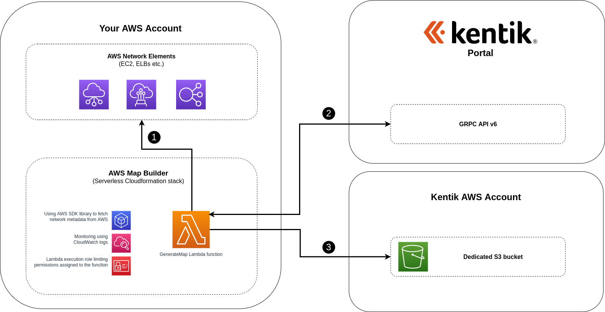

# AWS Map Builder: Technical details

The solution is based on [AWS Serverless Architecture Model](https://aws.amazon.com/serverless/sam/) (AWS SAM) and [AWS SAM CLI](https://docs.aws.amazon.com/serverless-application-model/latest/developerguide/serverless-sam-cli-command-reference.html) so it works with commands to build and deploy using it. AWS SAM relies on AWS Cloudformation and its concept of stacks that combine a set of resources required to run particular functionality.

Both AWS Cloudformation and AWS Lambda are serverless concepts, which means, they are virtual infrastructure elements making it very lightweight and cheap solution to run the procedure of collecting the AWS network infrastructure information.

Thanks to the fact this solution is written with AWS SAM CLI and NodeJS run-time, it is also open-sourced, so that you can verify what operations it does in order to collect network infrastructure information before sending it to Kentik Portal.

## Overview diagram

Each periodical execution of GenerateMap Lambda function consists of the following steps (numbered on diagram above)

1. Collect network infrastructure information using AWS-SDK
   - call [EC2](https://docs.aws.amazon.com/AWSEC2/latest/APIReference/API_Operations.html), [Direct Connect](https://docs.aws.amazon.com/directconnect/latest/APIReference/API_Operations.html), [Elastic Load Balancer](https://docs.aws.amazon.com/elasticloadbalancing/latest/APIReference/API_Operations.html) and [Network Firewall](https://docs.aws.amazon.com/network-firewall/latest/APIReference/API_Operations.html) AWS APIs (using AWS-SDK) to collect relevant network metadata information
   - Lambda function is limited with regards to its permissions around AWS-SDK operations using [Lambda execution role](https://docs.aws.amazon.com/lambda/latest/dg/lambda-intro-execution-role.html), defined within [stack template file](../template.yaml) (`Policies` property). Thanks to that user can be certain no other operations around listed AWS APIs are performed once the function is invoked.
   - The response set is then combined into single network infrastructure file (a.k.a. network map file).
2. Call Kentik GRPC API endpoint that provides storage location at which to store network infrastructure file
   - Lambda function does not know where to upload the network infrastructure information. Therefore it calls dedicated Kentik API to determine that.
   - Currently Kentik API responds with AWS S3 presigned URL, but this may change in future.
3. Compress and upload network infrastructure file into location provided at step 2.
   - Lambda function compresses the network infrastructure file and uploads it to the target URL provided the step before.
